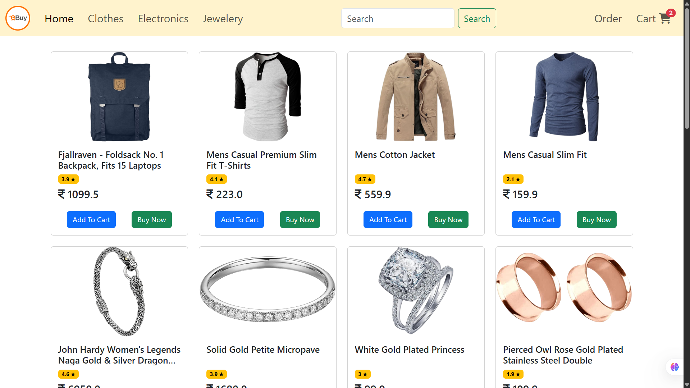
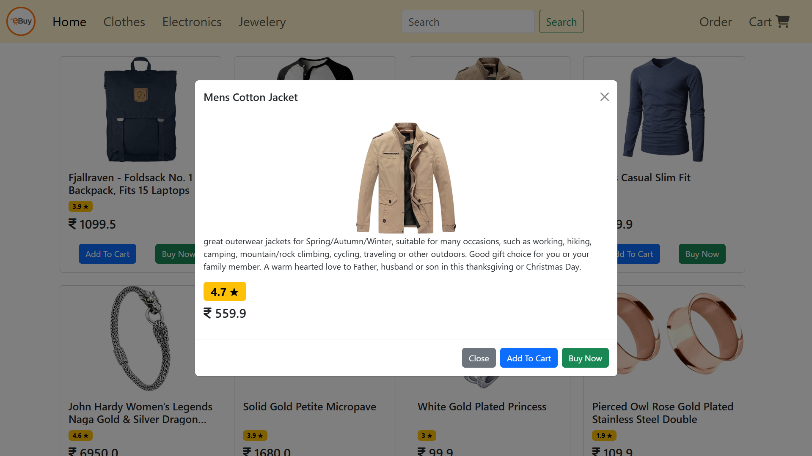
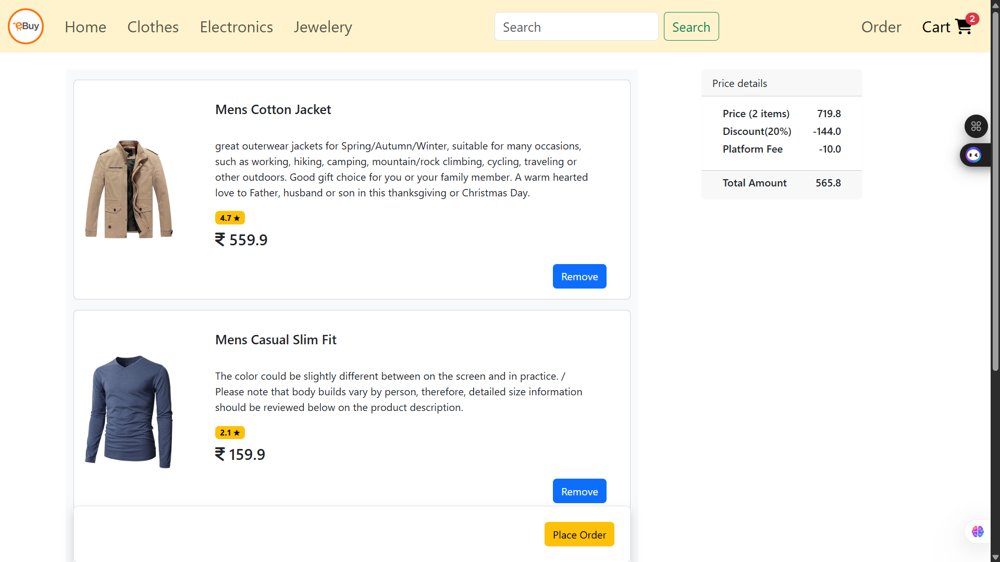
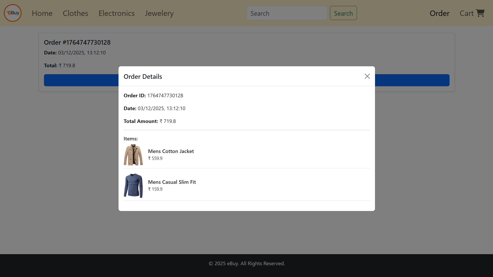

# eBuy – Modern E-Commerce Web App


eBuy is a fully responsive e-commerce website built using HTML, CSS, JavaScript, and Bootstrap.
The app allows users to browse products, search, filter by category, add items to the cart, place orders, and view order history — all stored using localStorage.


## 🌐 Live Demo

Experience the application live here: 👉 https://e-buy-small-e-com.vercel.app/index.html
## 🚀 Features

### Product Listing
- Fetches data from Fake Store API

- Category-wise filtering (Clothes, Electronics, Jewelery)

- Search functionality

- Product details modal

### Cart System
- Add to cart
- Remove from cart
- Live cart badge update
- Cart total calculated using Array.reduce()
- Discount & platform fee auto-applied

### Cart System
- Place order

- Saves order history in localStorage

- View order details in modal

### Responsive UI
- Bootstrap-based modern design
- Sticky price section
- Smooth layout for mobile & desktop


## Screenshots

### Home Page

### Product Modal

### Cart Page

### Order Page



## Tech Stack 

- HTML5
- CSS3 / Bootstrap 5
- JavaScript (ES6)
- Axios (API calls)
- LocalStorage


## API Used

#### Fake Store API


```
  https://fakestoreapi.com/products
```

## 👨‍💻 About the Developer
This project was built by Md Tufail.

- Role: B.Tech Computer Science student with a passion for software development and building interactive web applications.

- Connect:
    - LinkedIn: linkedin.com/in/tufailmd
    - GitHub: github.com/TufailMd
    - Email: jrtufailmd@gmail.com
```
## Support

If you like this project, please give it a ⭐ on GitHub!

```